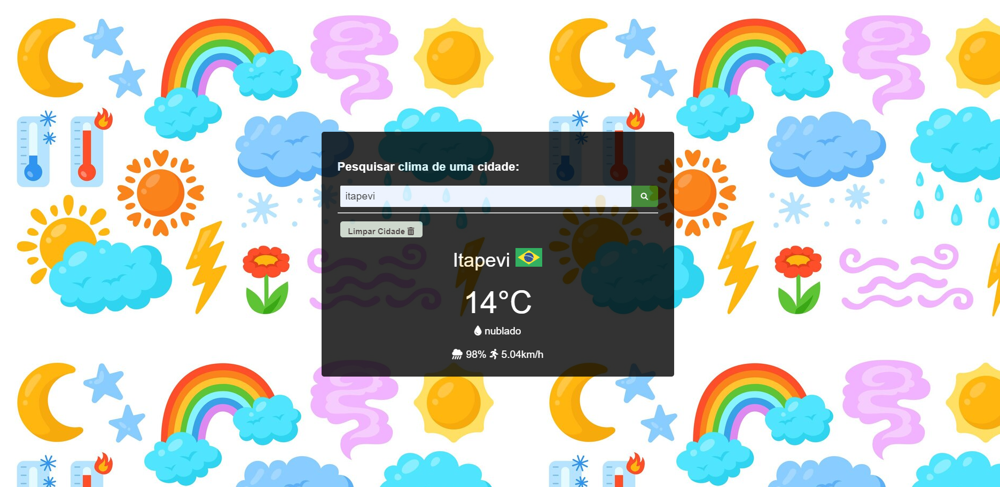

# Clima nas Cidades

## Aplicação criada com as seguintes tecnologias:
* Html
* Css
* Javascript

## Informações da tela Criada 
* Foi uma grid responsivo criado com cards de pokemons onde fazemos uma chamada de api.
* Com o retorno montamos um grid de dados com retorno dos dados.
* E com as informações mostramos dados de cada pokemon.

